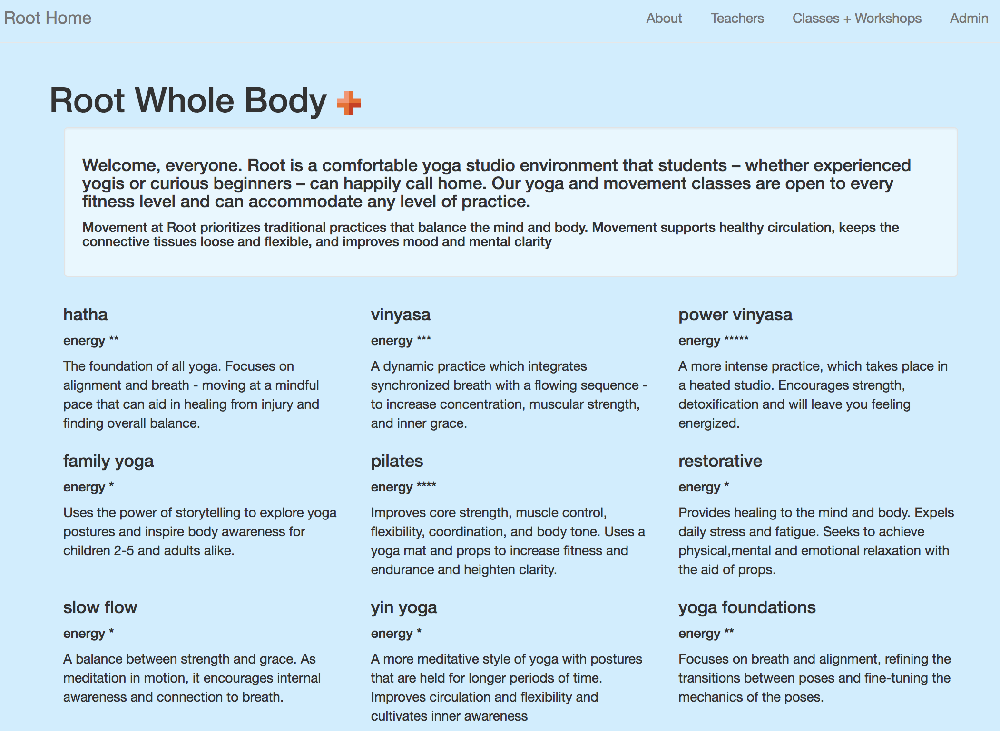
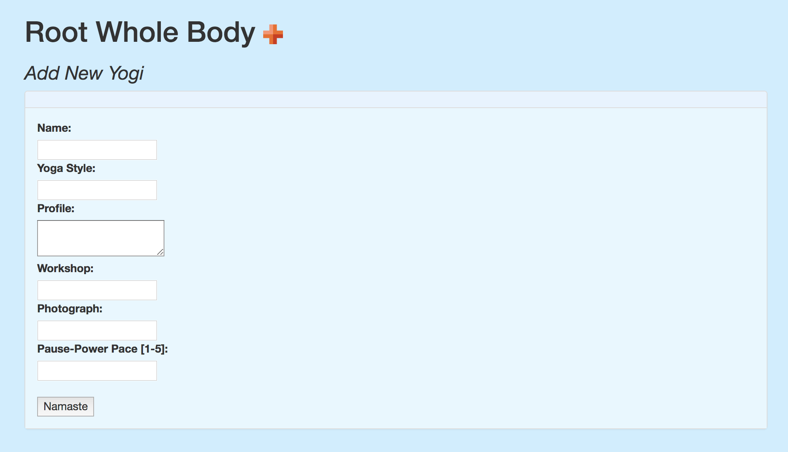
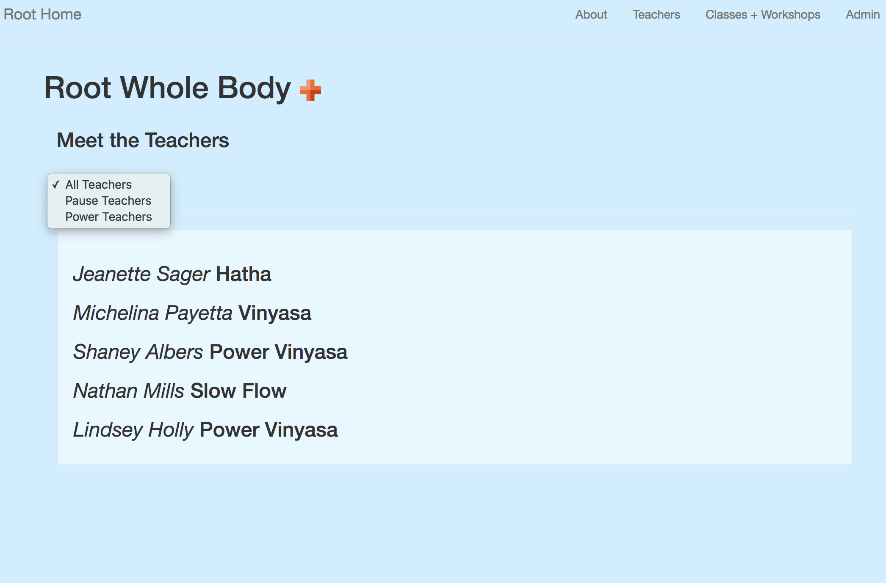

# Studio

This project was generated with [Angular CLI](https://github.com/angular/angular-cli) version 1.0.0.

By _Brittany Kerr_ [e-mail me](<mailto:kerrbrittany9@gmail.com>)

## Description

This web app allows users to view yoga class descriptions and teachers who instruct at Root Whole Body. The user can filter the teacher list by class pace, pause or energy, and can click each teacher to see their full profile. The admin page allows users to add, update or delete a teacher.

## Studio Program Preview

_Home Page Introduces the Classes and the Class Concepts_


_Users can use nav-bar to maneuver to class calendar._


_Users can view teacher profiles highlighting their experience and workshops._


_Administrative users can add a teacher to the list with yoga style and yoga class pace outlined._


_Admin users can filter power and pause teachers to find quick teacher substitutions._


## Prerequisites

You will need the following things properly installed on your computer:
* [Git](https://git-scm.com/)
* [Node.js](https://nodejs.org/) (with NPM)
* [Angular](https://cli.angular.io/) (in Terminal: $ npm install -g @angular/cli@1.0.0)
* [TypeScript](https://www.typescriptlang.org/) (from NPM in Terminal: $ npm install typescript -g)
* [Bower](https://bower.io/)


## Installation

* Open Github site in your browser and copy: https://github.com/kerrbrittany9/studio
* Open Terminal on your computer and follow these steps:
  * `$ cd desktop`
  * `$ git clone <paste repository-url>`
  * `$ cd studio`
  * `$ npm install`
  * `$ bower install`

## Firebase

You will need to create an account with [Firebase](https://firebase.google.com/). Once you've created an account, you should be taken to a user dashboard area, with an option to Create a New Project. Select this option, provide a name for your new project, and select your Country/region from the drop-down menu.

You'll then be taken to an "Overview" area. Where you'll be offered three options. Select `Add Firebase to your web app`
Make a file: src/app/api-keys.ts, which will hold the Firebase credentials. Replace the xxx with your credentials.
````
export var masterFirebaseConfig = {
    apiKey: "xxxx",
    authDomain: "xxxx.firebaseapp.com",
    databaseURL: "https://xxxx.firebaseio.com",
    storageBucket: "xxxx.appspot.com",
    messagingSenderId: "xxxx"
  };
````

## Development server

Run `ng serve` for a dev server. Navigate to `http://localhost:4200/`. The app will automatically reload if you change any of the source files.

## Known Bugs

If you have an error message "Module not found: Error: Can't resolve 'promise-polyfill' in `.../firebase/app'`"

install the promise-polyfill package by using this command in your terminal:

`$ install promise-polyfill --save-exact`

## Technologies Used

Angular 2 JavaScript, TypeScript, Node.js, Bootsrap, CSS, HTML

## Code scaffolding

Run `ng generate component component-name` to generate a new component. You can also use `ng generate directive/pipe/service/class/module`.

## Build

Run `ng build` to build the project. The build artifacts will be stored in the `dist/` directory. Use the `-prod` flag for a production build.

## Running unit tests

Run `ng test` to execute the unit tests via [Karma](https://karma-runner.github.io).

## Running end-to-end tests

Run `ng e2e` to execute the end-to-end tests via [Protractor](http://www.protractortest.org/).
Before running the tests make sure you are serving the app via `ng serve`.

## Further help

To get more help on the Angular CLI use `ng help` or go check out the [Angular CLI README](https://github.com/angular/angular-cli/blob/master/README.md).
